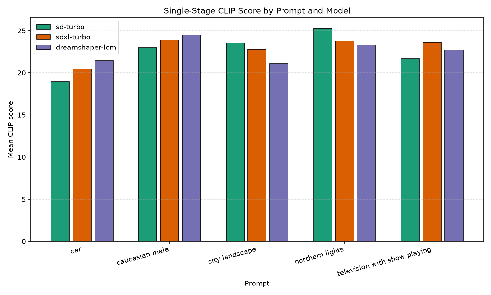
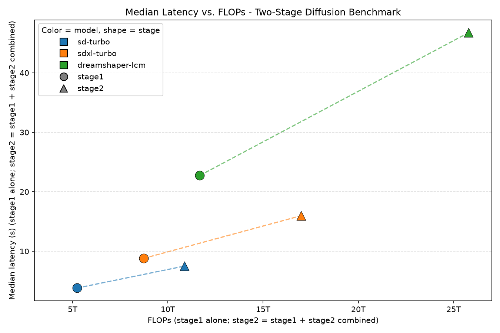

# Reffusion

Reffusion is a chat style web app for generating images from text prompts. A user creates a chat, picks a diffusion model, and sends prompts. From the second message onward, the previous image can be used as a conditioning input, so a chat becomes a sequence of image edits rather than one shot generations. The backend is a Django REST API with token authentication and per account chat history. The frontend is a small Vue 3 and TypeScript app built with Vite.

The `benchmark` directory is a separate, standalone project that grew out of a simple question: of the diffusion models the app supports, which one actually produces the best images, and at what speed cost? It does not import anything from the Django app. It keeps its own copy of the model registry so it can be run and reasoned about on its own.

## Running the app

Backend:

```
cd reffusion_data
pip install -r ../requirements.txt
python manage.py migrate
python manage.py runserver
```

Frontend:

```
cd frontend
npm install
npm run dev
```

The frontend talks to the Django API for login, chat creation, and image generation. Model weights are downloaded from Hugging Face the first time a given model is used.

## The benchmark

Four diffusion checkpoints were evaluated: `sd-turbo`, `sdxl-turbo`, `dreamshaper-lcm` (an LCM distilled Dreamshaper checkpoint), and a turbo distilled variant of Stable Diffusion 3.5 Medium. All development and measurement was done on a 16GB Apple Silicon Mac using PyTorch's MPS backend, which shapes a lot of the design here. A fifth model, FLUX.2 Klein, was tried and dropped because its memory footprint did not fit on this hardware even with VAE tiling enabled.

Each model generates images for five fixed prompts, using the same set of 100 random seeds across every model and prompt, so outputs are directly comparable seed for seed. Each generated image is scored with:

- CLIP score, the cosine similarity between the image and its prompt in CLIP embedding space, measuring how well the image matches what was asked for.
- An aesthetic score from LAION's improved aesthetic predictor, a small regression head trained on human ratings of CLIP image embeddings.
- LPIPS diversity, the average perceptual distance between images generated from different seeds of the same prompt. A model that produces near identical images across seeds scores low here even if each individual image looks fine.

Latency is recorded per image as well.

There is also a two stage variant of the benchmark. Stage one is normal text to image generation. Stage two takes that image and runs it back through the same model with img2img, using a prompt that asks the model to refine its own output, to see whether a self refinement pass reliably improves quality. It does not, at least not with the settings tested here: the effect is small and model dependent, sometimes trading aesthetic score for CLIP alignment or the reverse, while output diversity across seeds increases in every case.

Running it:

```
cd benchmark
pip install -r requirements.txt
python run_benchmark.py --output-dir ./output
python run_benchmark_two_stage.py --output-dir ./output_two_stage
```

Both scripts accept `--models` to run a subset, and write a CSV of per image results, a CSV of per prompt diversity stats, and a `summary.json` with the aggregated numbers. A crash partway through only aborts the model that was running; results already written for other models are kept and merged back in on the next run.

## Results

CLIP score by prompt, for the three models that ran the full single stage benchmark on this hardware:



The three models land close together on most prompts. None of them is a clear winner across the board, which on its own is a useful finding: at this size and step count, model choice matters less than the specific prompt being asked.

Median latency against FLOPs per generation pass, for the two stage benchmark:



FLOPs are measured directly, by wrapping a real generation call in PyTorch's flop counter rather than estimating from parameter counts. Latency tracks compute reasonably well but not perfectly. `sdxl-turbo` sits above where its FLOPs alone would predict, which points at overhead beyond raw floating point operations, likely its two text encoders or how well its particular mix of operations runs on MPS.

## Notes on running diffusion models on 16GB of unified memory

A meaningful part of this project ended up being about memory management rather than model comparison itself, since a few things broke in ways worth writing down:

- The VAE decode step upsamples latents to full image resolution in a single pass, which is the single biggest memory spike in generation. Enabling tiling and slicing on the VAE fixes this without any quality cost.
- PyTorch's MPS caching allocator does not reclaim memory fragments on its own across hundreds of sequential generations. Left unchecked, a long run gets progressively slower and starts swapping. Clearing the cache after every image avoids this.
- Some model repos bundle the default Stable Diffusion NSFW safety checker, which silently replaces flagged images with a solid black square instead of raising an error. This was found because it was quietly corrupting about a third of one prompt's results for one model, replacing many different seeds with identical black images that still produced plausible looking CLIP and aesthetic scores. It is disabled for every model here, since a benchmark measuring image quality should not have some fraction of its data silently replaced with black squares.
- Loading a model's own scoring dependencies, CLIP and the aesthetic predictor, on the same device as the diffusion model competes for the same memory pool as the model actually being tested. Keeping them on CPU instead frees that memory for the model under test at a small cost in scoring speed.
